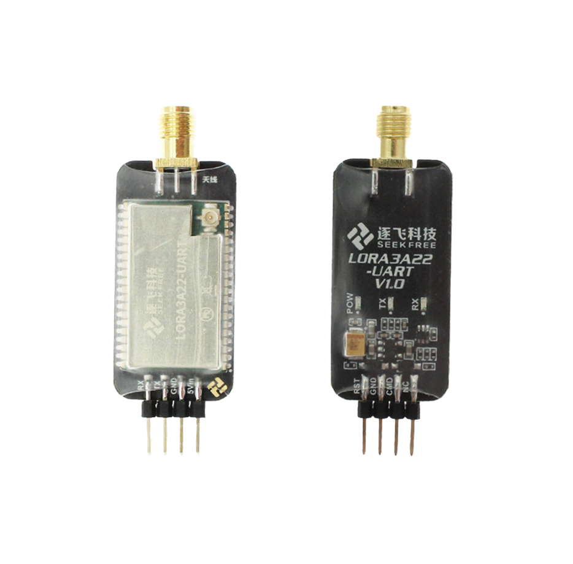
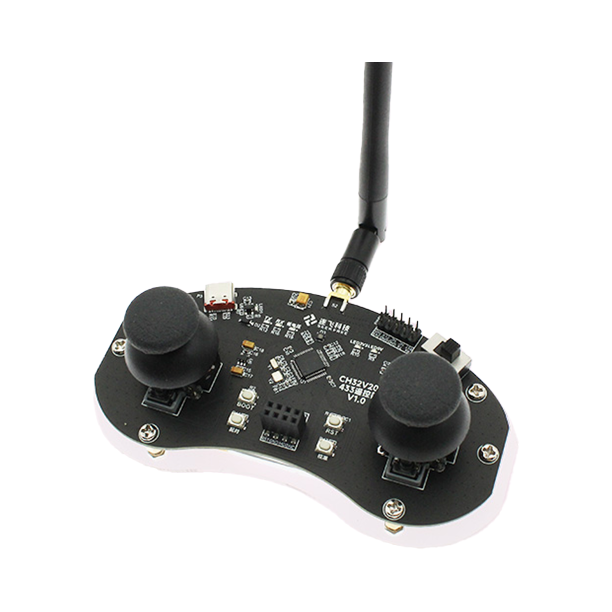

# 逐飞科技LORA3A22无线模块资料

#### 介绍
逐飞科技针对需要远距离内实现串口透传的应用，精心制作了LORA3A22无线模块，可实现超800米的通讯距离。

#### 软件架构

#### 学习套件
LORA3A22无线接收器模块:[点击此处购买](https://item.taobao.com/item.htm?id=766397674356&pisk=g4YIAGZpjJ2QHfMkjpcN1T8z6X_WFfuqN71JiQUUwwQdez92K35rtXx1wLJiZXbewT9WQO4eYDjPF766pzSePQ45wQpotTlnbBAhraHq3ag2tBbEVJVWR9QTXCfVeynNvq9IxGDq3quSv5QSdxJeIIlQWs1Ay6IRwOh1a66RykCK1OC5iTUpeLdt1_CYvuURy5BOIsq829ELBlCAMyEdwLdt1_XOeaIKtG41wD1vOXhAdIguxZOdCzUJJ4jChOqzPzsF9MTJ9ONa_F1CAtIavug2JdRJ8eji0obk_n9W2d3_RLOpDLBeWxU5UnYH6FsbwzR15TOcpZN-JC_CdiLwKqUyHCOJ0GTZMqbCJ9KP-QPjLCTBLBY6a7EORw-1ce_xoJBybIT5NUDo5KOpDLK54E4Vhm2YV5s0P16q1fZuqJkbYCJg5UcAv1fI3fG_Kujds1_DzfZ-wMCGOxcs1omh.&spm=a1z10.3-c-s.w4002-22508770840.10.35df49ccDNElhA)。

LORA3A22 433M遥控器 :[点击此处购买](https://item.taobao.com/item.htm?id=777808402474&pisk=gB0IAHsKj9XIV49ojvAa18uP6BaSNC82N_N-ibQFwyULeaMqK0PytBm_wYkMZB4Ew8MSQRbEYHqzF_wsparEPbb7wbHkt8RHbXc3rzp23zTqtX4eV9fSRWEOBfV498KavEMBxlv23E8Wv1UWdKkEIP71WSNYyWE8wRd_aWw8yMQp1RF7i8QKeYh917FAvgQ8y1eTISXdpaUR65FuaaBLeYh9172TezEKGI7_wHNxOBdYdjTkYal3CaQ-55puHX9dP5ugOS2j92_Ry7VQA-hLCKooXArtZuglZaZn9mDuMvBpdzh_GxNjd35udchq8JlfGNG_-JZ-yf-J9fg7do3LfsR8RfV-euiMhZPQ8cZjRDAlBXH4dmUnas9E1oi_m5EONMUE0juuD2LCnRr0NxNjd9syoZyXmtI51ob71-R61gjlLKsE_AbsrIELsW921C6hqkFg1r0y1gd8v5VBnCO1mHf..&spm=a1z10.3-c-s.w4002-22508770840.12.35df49ccDNElhA)。

#### LORA3A22无线收器模块

#### LORA3A22 433M遥控器

#### LORA3A22无线收器模块性能参数

1. **供电电压**：5V
2. **工作电流**：发射时最大110mA
3. **波特率选项**：1200、2400、4800、9600、19200、38400、57600、115200
4. **信道数量**：116个
5. **频率范围**：410~525MHz
6. **通讯速率**：1.2-625.Kbps(八级可调)
7. **传输距离**：空旷无障碍最大200米(4.8K速率时)

#### 遥控器基本信息

1. **遥控器电压范围**：支持1s电池供电和充电
2. **遥控器产品净重**：约98g
3. **遥控器传输距离**：最大5KM
4. **遥控器发射功率**：22dBm
5. **遥控器调制技术**：LoRa
6. **遥控器工作电流**：正常发送模式，100hz频率发送一次数据，电流约24ma
7. **遥控器MCU**：CH32V203C8T6芯片
8. **遥控器无线模组**：LORA3A22
9. **遥控器八级空速可调**：1.2到62.5kbps
