# 基于CH32V203的无线遥控器开源项目

## 简介
本开源项目基于沁恒CH32V203C8T6搭配LORA3A22无线模块，实现的双摇杆四通道遥控器，极限传输距离高达5000米。接收模块可以插在遥控器上进行快速配对，支持摇杆校准，支持通过TYPE-C给1S锂电池充电，支持1S锂电池低电压提示。

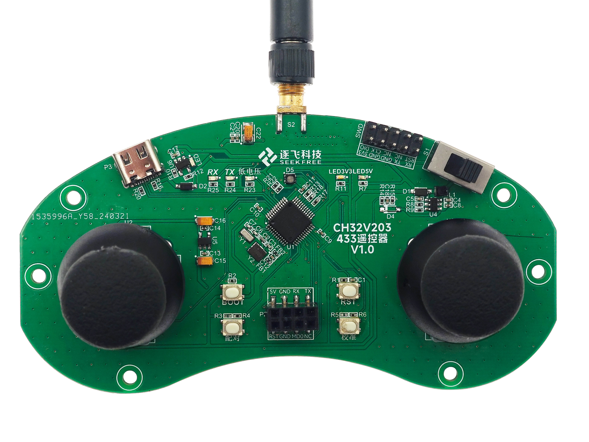

## **一、遥控器主要构成说明**

### 1.1、遥控器硬件框图

该遥控器支持TYPE-C供电或者1S锂电池供电，并自带充电电路，可通过TYPE-C给1S锂电池进行充电。支持电池低电压提示，LED提示工作状态等功能。

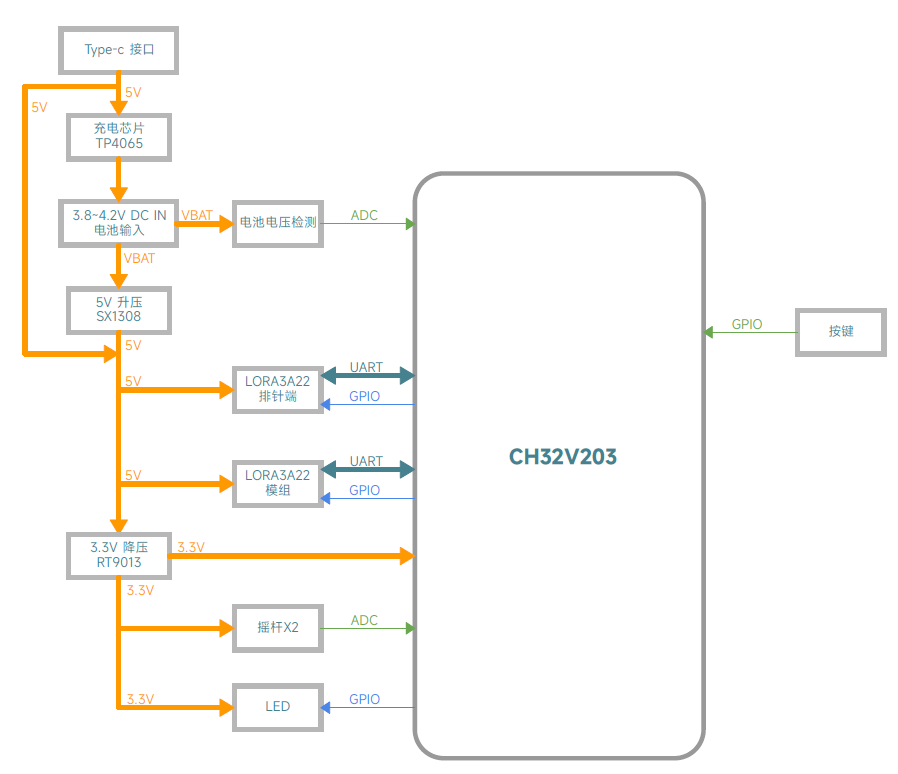

### 1.2、遥控器原理图

原理图看不清楚也没有关系，在gitee上面我们提供了原理图PDF文件。

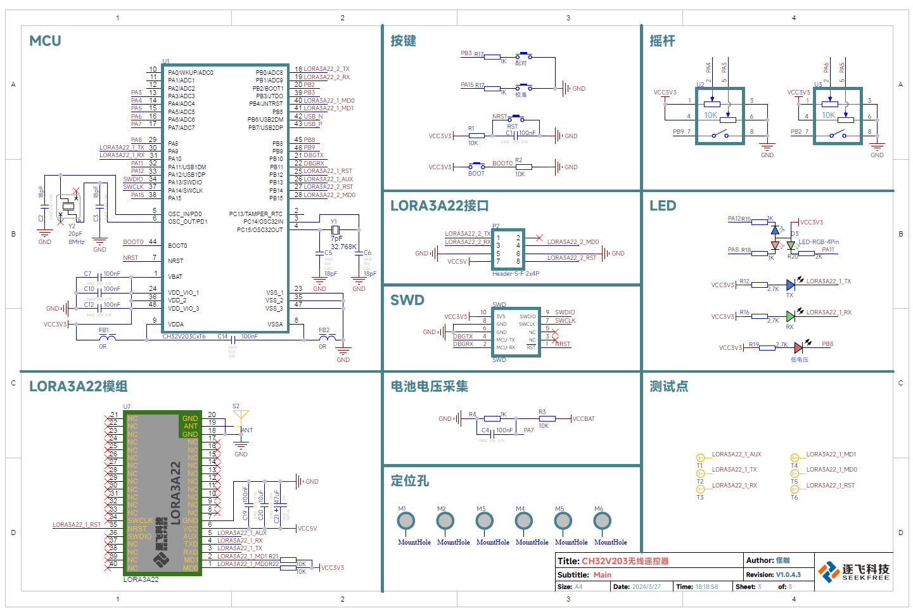

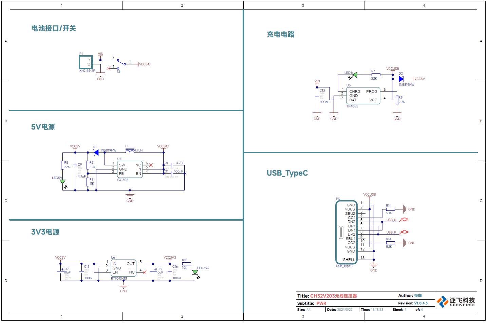

### 1.3、主控芯片

主控芯片使用沁恒微电子的CH32V203C8T6，它有以下优点：

1、最高144Mhz系统频率。

2、具有20KB SRAM和64KB Flash。

3、支持多种低功耗模式：睡眠、停止、待机。

4、较低的功耗：运行模式低至49.3uA/MHz、睡眠模式低至19.4uA/MHz。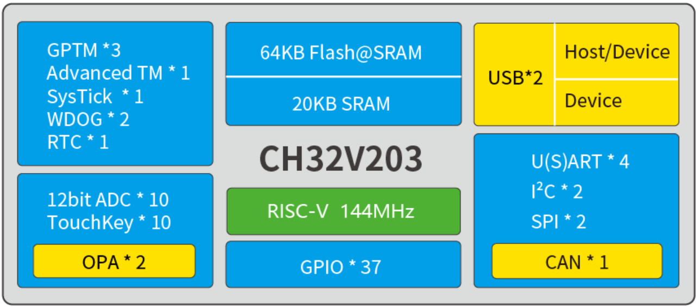

### 1.4、无线模组

无线模组使用逐飞科技定制LORA3A22模组，它有以下优点：

1、支持休眠模式，休眠电流低至2.4uA。

2、较大的发送功率，最高22dBm。

3、最大传输距离高达5km。

4、较宽的波特率范围：1200bps到115200bps。

5、八级空速可调：1.2到62.5kbps。

6、无线频率410到525MHz可调，拥有116个信道。

### 1.5、充电芯片

使用TP4065电池充电芯片，TP4065 是一款完整的锂电池充电器。拥有以下优点：

1、世界首创带电池正负极反接保护、输入电源正负极反接保护的单芯片。

2、最大充电电流可设置为600mA，本项目设置为500mA。

3、会自动进行涓流、恒流、恒压控制。

4、SOT23-5 封装与较少的外部元件数目使得 TP4065 成为便携式应用的理想选择。

### 1.6、摇杆的选型

我们选用的是双路模拟输出，一路数字量输出的摇杆，它具有以下优点：

1、精准控制：摇杆式电位器通常具有较高的精度，可以提供精确的控制和调节。

2、耐用性：大多数摇杆式电位器采用耐用的材料和设计，能够经受长时间的使用和频繁的操作。

3、双路模拟输出：一个摇杆具有两个模拟通道，使用单片机ADC功能可以非常方便采集通道数值。

4、一路数字量输出：直接将摇杆按下，可以当做普通按键使用，单片机获取摇杆对应的引脚状态即可。

## **二、**遥控器功能实现说明

遥控器对于实时性的要求并不高，但是却有着不同的任务需要执行，为了更加简单的管理这些任务，因此我们引入了实时操作系统（RTOS）来对这些任务进行管理，对于操作系统来说，每一个线程都相当于一个独立的主函数。我们便可以给每一个任务创建一个线程运行对应的程序。本次开源项目使用rt-thread操作系统。

目前遥控器实现了以下功能：

1、LORA模组自检

2、通过LORA发送摇杆数据

3、工作状态RGB显示

4、低电压检测与显示

5、摇杆ADC校准

6、遥控器与接收模块快速配对

7、低功耗和正常发送模式自动切换

8、支持TYPE-C供电

9、支持1S锂电池充电和供电。

### 2.1、主函数

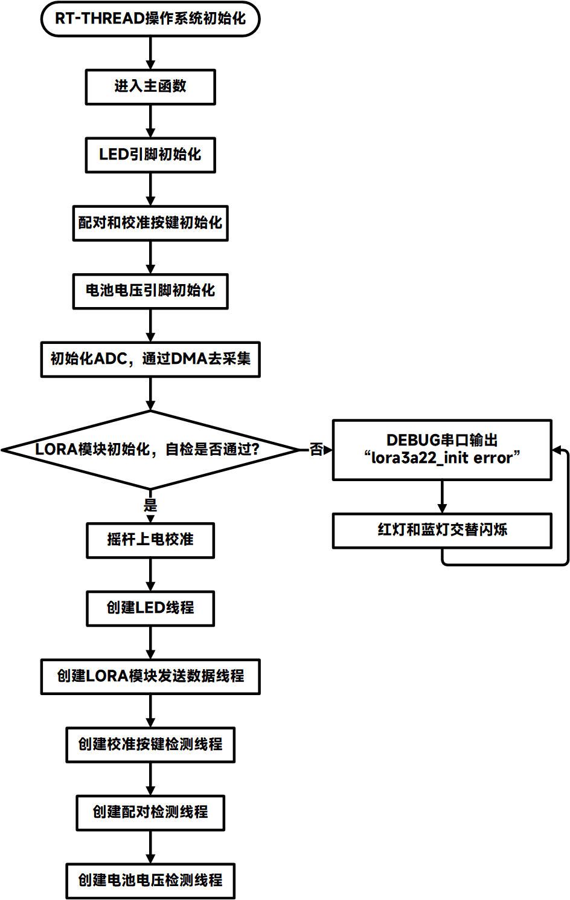

操作系统初始化完成后，就会进入主函数，主函数里面主要是做各种外设的初始化，LORA模块自检，自检成功则继续运行程序，自检失败，红灯闪烁，停止运行程序。自检成功之后创建其他所需的线程。

### 2.2、LORA发送数据线程

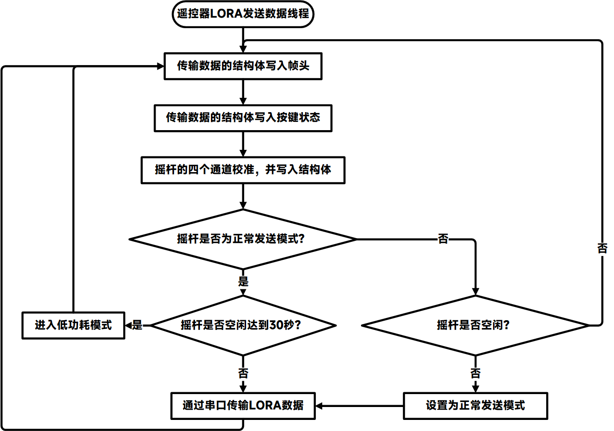

发送数据线程，在代码中函数名称为：lora3a22_send_thread。实现了通过LORA模组发送摇杆传输数据，低功耗和正常模式的切换。

这个功能是整个遥控器的核心功能之一。使用CH32V203C8T6的ADC采集摇杆通道数据，使用GPIO获取摇杆按键状态，通过串口传输到LORA3A22无线模块，LORA3A22无线模块再发送给接收设备。如果超过30秒没有操作遥控器，就将LORA模块设置为低功耗休眠模式。在休眠模式下，操作一下摇杆，就立刻进入正常发送数据模式。

### **2.3**、LED显示线程

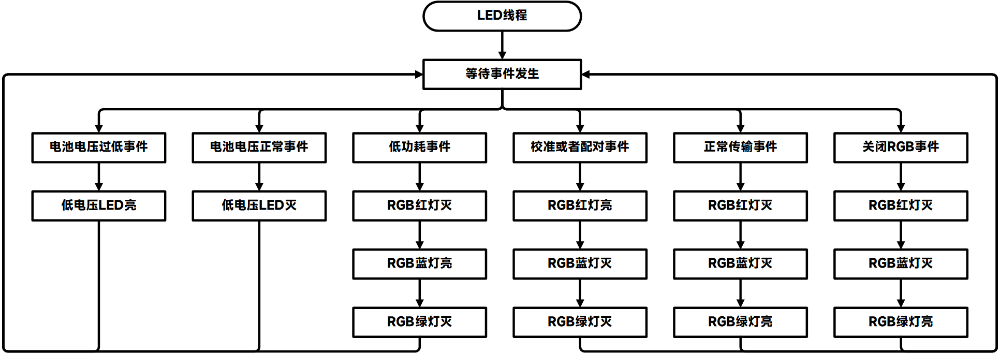

LED显示线程，在代码中函数名称为：led_thread。该线程是控制所有LED亮灭的接口。使用三色RGB更直观的表示现在的工作状态和错误提示。另外还有一个低电压提示LED。

其中RGB LED状态含义如下：

1、绿灯常亮-正常发送模式

2、蓝灯常亮-低功耗模式

3、红灯常亮-正在配对或者校准

4、红灯闪烁-自检失败

5、红蓝灯交替闪烁5秒-配对失败

低电压LED状态含义如下：

1、低电压LED熄灭-电池电压正常

2、低电压LED闪烁-电池电压过低。

### **2.4**、电池电压检测线程

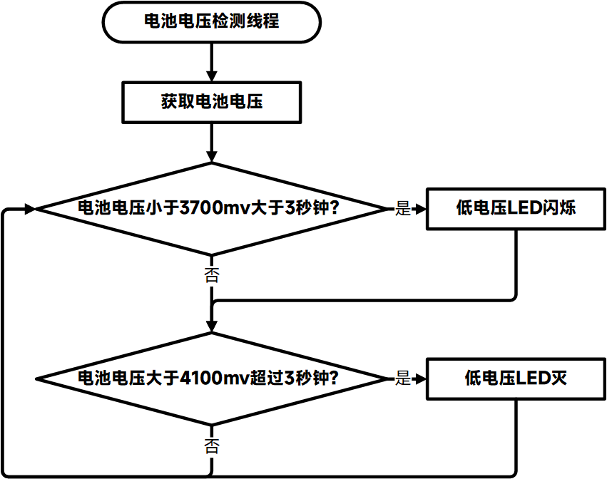

电池电压显示线程，在代码中函数名称为：battery_thread。

电池电压检测线程，通过分压电阻对电池电压进行分压，然后通过AD转换，采集到电池电压。当电池电压低于3700mv的时候，低电压LED指示灯闪烁。当电池电压高于4100mv的时候，低电压LED指示灯熄灭。

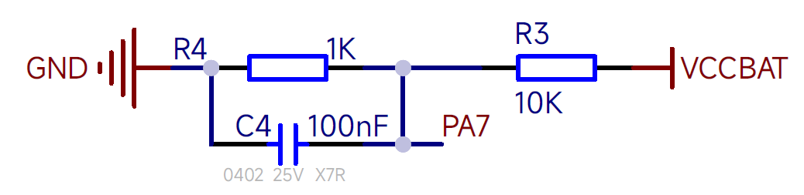

电池电压检测是通过单片机ADC测量电阻分压之后的电压（如上图所示），然后反推电池电压的。CH32V203单片机引脚能承受的电池电压最大值为3.3V。而电池电压往往高于3.3V，这里就需要将电池电压经过分压电阻后，输入进单片机AD引脚上。最终电池电压的计算公式如下：

### **2.5**、摇杆ADC校准线程

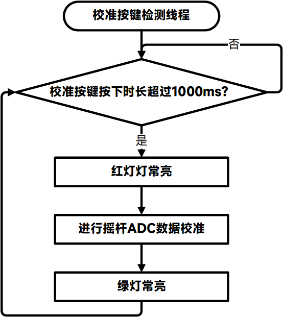

摇杆ADC校准线程，在代码中函数名称为：calibration_thread。

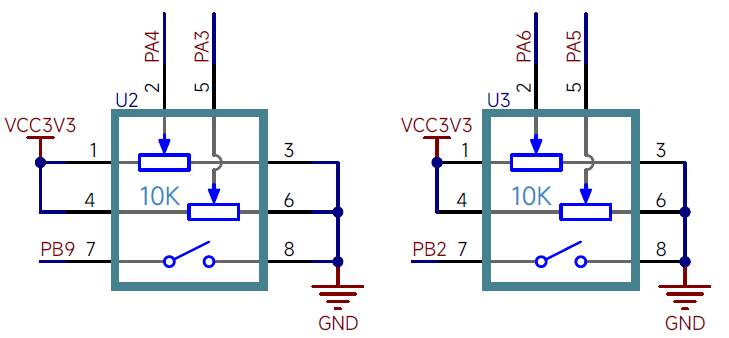

摇杆内部实际上是两个电位器，通常我们期望摇杆在中间的时候，通道的值应该为0，因此我们需要获取摇杆在中心位置时的数值并记录下来，这样之后每次获取到通道值之后减去记录下来的值，就可以保证摇杆在中间的时候通道的值为0，不过由于电位器始终是一个机械装置，随着时间总可能会出现偏差，当出现偏差的时候就需要重新校准一下，重新测量一下摇杆在中间时的数值并重新记录即可。 

在代码中默认上电校准，上电时获取摇杆ADC数据并保存，因此在上电的时候务必保证摇杆在中间位置。也可以在运行时，按住校准按键1秒，进行手动校准，校准时RGB亮红灯，校准完成RGB变成绿灯。 

### **2.6**、无线LORA模组配对

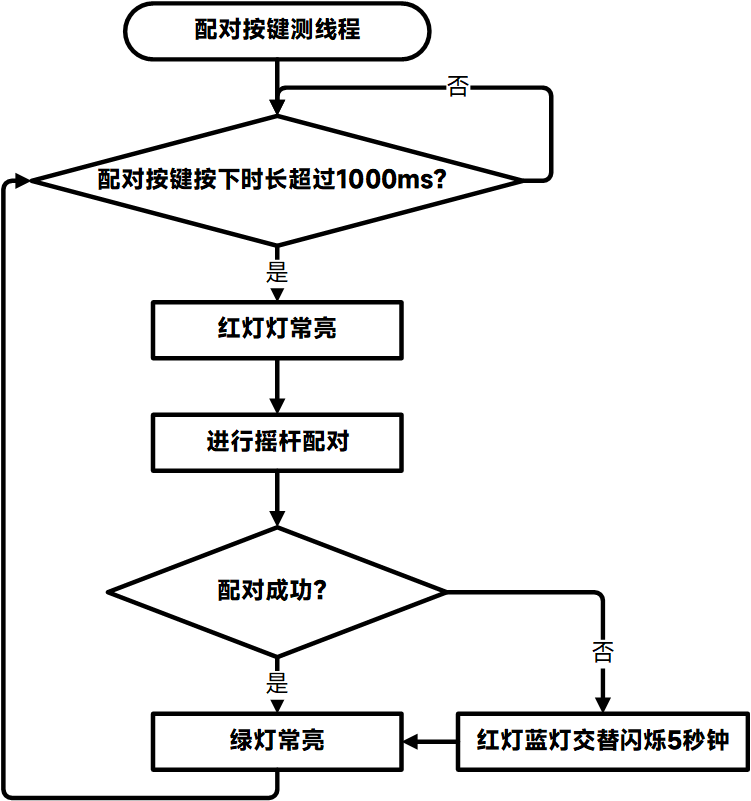

无线LORA模组配对线程，在代码中函数名称为：pair_thread。

为了方便使用，提供模块自动配对功能，插入LORA3A22排针端，按下配对按键1秒钟，进行随机设置信号、组、地址等。进行配对，配对时红灯RGB红灯亮。配对成功，RGB绿灯常亮，配对失败则红灯蓝灯交替闪烁。

## **三、遥控器代码部分**

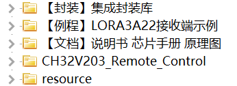

CH32V203_Remote_Control文件夹 里面放置的是：基于CH32V203的LORA遥控器开源代码。

resource文件夹 里面放置的是：开源项目编写README.md文件所需要的图片、流程图等资源。

【封装】集成封装库文件夹 里面放置的是：遥控器所需的原理图封装和PCB封装

【例程】LORA3A22接收端示例文件夹 里面放置的是：各个单片机的遥控器接收端示例。

【文档】说明书 芯片手册 原理图 文件夹里面放置的是：使用说明书，CH32V203芯片手册，遥控器原理图等文档资料。

这里，我们打打开下载后的代码，可以看到代码目录如下：

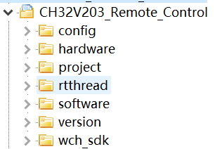

**config**文件夹下放置的是遥控器配置文件。

**hardware**文件夹下放置的是必要的外设初始化，例如串口、GPIO、ADC等。

**project**文件夹下放置的是工程项目文件，双击mrs目录下面的CH32V203_Remote_Control.uvprojx文件即可打开工程。

**rtthread**文件夹下放置的是rt-thread操作系统相关的文件。由这个文件夹提供操作系统相关的东西。

**software**文件夹放置的是逐飞科技精心编写lora模组自检、配对、校准、配置以及环形缓冲区等程序文件。

**version**文件夹下放置的是版本更新记录，以及开源许可。

**wch_sdk**文件夹放置的是沁恒微电子提供的sdk。

## **结束语**

以上就是本次基于CH32V203的无线遥控器开源方案简要介绍分享的全部内容了，文中提到的遥控器软硬件功能均已验证，遥控器也已上架逐飞淘宝店：

https://item.taobao.com/item.htm?ft=t&id=777808402474

[**点击此处购买**](https://item.taobao.com/item.htm?ft=t&id=777808402474)

感谢各位的支持，你们的支持是我们开源的动力，如果能帮到大家，深感荣幸。

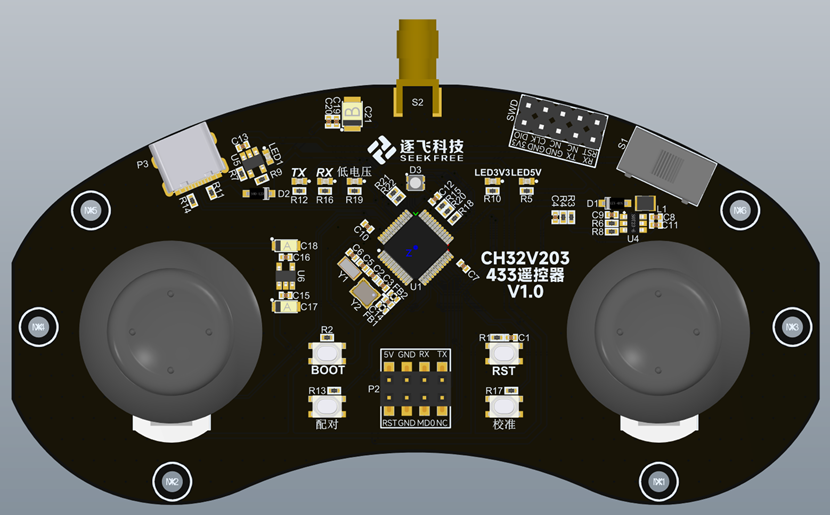

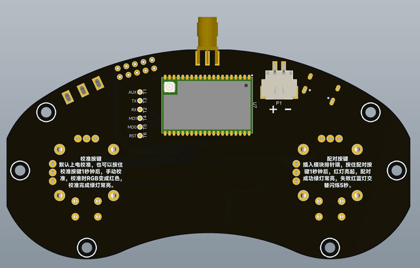

**特别提醒：参赛所需的无线遥控器需要参赛同学自行设计制作，该开源项目仅供前期学习参考，不能使用成品遥控器参赛。**

本期**逐飞基于CH32V203的无线遥控器开源项目**就大致介绍到这里了，制作该开源项目的目的是对合作伙伴沁恒提供的主控MCU芯片CH32V203做一个与赛题需求结合的验证，同时也是对售卖的遥控器的严谨验证，开源的遥控器方案或许能对新手入门有些许帮助，能够简要的对遥控器进行一个任务分解和所需知识梳理，为新手进行学习方向引导。遥控器的PCB，均不公开，不出售，不赠送。这些内容并不复杂，是完全符合大学生能力定位的，如果一些新手朋友还比较迷茫，可以尝试根据本文分享的开源项行动起来，亲手做出自己的遥控器，编写自己的代码，这些都是可以实现的，希望每个参赛的同学都能知其然并知其所以然，不偷懒，不走捷径，理解到，自己亲自动手做一遍，知识才是自己的。行动是最好的老师！

并且我们的制作的遥控器并不是最好的方案，更好的方案、算法都需要车友们去思考和发现，这样你才能成为一名合格的工程师，将来才能有一技之长。所谓的工程实践活动，就是需要你去实践，根据比赛要求设计制作遥控器，才会有收获，最后，祝愿车友们制作出让自己满意的遥控器，最终能在竞赛中取得自己满意的成绩，玩的开心！

